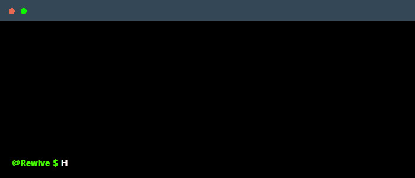

<h1 align="center">💫 About Me:</h1> 
  
 
 
  👋 Hi! My name is Ivan. I am an experienced developer with a wide range of skills, including working with tools and technologies such as PS, Figma, Nest.JS, Node.JS, MongoDB, MySQL, PostgreSQL, Mongoose, Typegoose, Prisma, HTML, CSS, JS, Vue.JS and Tailwind. I am constantly striving to expand my knowledge and skills to be at the forefront of technological progress.

I am confident in my ability to work both independently and in a team. My goal is to create quality products that meet the needs of clients and exceed their expectations. I am always open to communication with HR managers and ready to discuss cooperation opportunities.
 
 
  
  
  
 <h2 align="center">🌐 Connect with me:</h2> 
  
 
 
    
    
    
 
 
  
 <h2 align="center">🛠️ Tech Stack:</h2> 
  
 
 
    
    
    
    
    
    
    
    
    
    
    
    
    
    
    
 
 
  
 <h2 align="center">📊 GitHub Stats:</h2> 
  
 
 
    
     
     
    
     
     
    
     
     
    
     
     
    
     
     
    
     
     
    
     
     
    
 
 
  
 <h2 align="center">🏆 GitHub Trophies</h2> 
  
 
 
    
 
 
  
  
 
 
      
 

